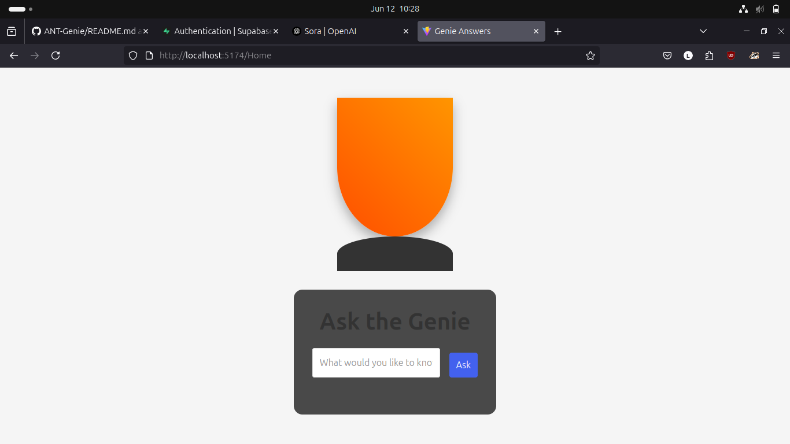

# Genie App with Supabase Authentication

A React application that provides magical genie responses through a Supabase Edge Function, with user authentication using Supabase Auth.

## 🖼️ Preview




## Features

- User authentication with Supabase Auth
- Secure login and signup pages
- Protected routes for authenticated users
- Genie responses edge function
- Responsive UI with magical theme

## Getting Started

### Prerequisites

- Node.js (version 14 or higher)
- npm or yarn
- Supabase account and project
- Docker (for local Supabase development)

### Setup Instructions

1. **Install Dependencies**
   ```bash
   npm install
   ```

2. **Configure Supabase**
   - Create a Supabase project at https://supabase.com
   - Copy your project ref and anon key from the dashboard
   - Create a `.env.local` file in the project root with:
   ```
   VITE_SUPABASE_URL=https://your-project-ref.supabase.co
   VITE_SUPABASE_ANON_KEY=your-anon-key
   ```

3. **Deploy Edge Function**
   - Navigate to your Supabase dashboard
   - Go to Edge Functions
   - Click "Upload Function"
   - Select the `supabase/functions/genie-responses` directory
   - Click "Deploy"

4. **Run Locally**
   ```bash
   # Start Supabase development server
   supabase start
   
   # In a new terminal, start the frontend
   npm run dev
   ```

5. **Access the Application**
   - Frontend: http://localhost:5173
   - Supabase Studio: http://localhost:54322
   - Edge Function: http://localhost:54321/functions/v1/genie-responses

## Technologies Used

- React
- TypeScript
- React Router
- Vite
- Supabase (Authentication & Backend)

## Project Structure

```
/
├── src/
│   ├── components/
│   │   ├── Genie.tsx
│   │   ├── Login.tsx
│   │   ├── Signup.tsx
│   │   └── ProtectedRoute.tsx
│   ├── lib/
│   │   └── supabaseClient.ts
│   ├── App.tsx
│   ├── App.css
│   ├── config.ts
│   ├── main.tsx
│   └── index.css
├── supabase/
│   └── functions/
│       └── genie-responses/
│           ├── index.ts
│           └── deno.json
└── _shared/
    └── cors.ts
```

## Edge Function Details

The edge function provides random genie responses in both English and Spanish. It can be called with a POST request:

```bash
# Example request
curl -i --location --request POST 'http://localhost:54321/functions/v1/genie-responses' \
  --header 'Authorization: Bearer YOUR_ANON_KEY' \
  --header 'Content-Type: application/json' \
  --data '{"language": "en"}'
```

## Authentication Flow

1. Users start at `/login` page
2. They can either login with existing credentials or signup for a new account
3. After successful login, they are redirected to `/Home`
4. The `/Home` page is protected and only accessible to authenticated users
5. If they try to access `/Home` without being logged in, they'll be redirected to `/login`

## Authentication Features

- Email/password authentication
- User registration
- Protected routes
- Real-time auth state management
- Automatic session management
- Secure authentication flow

## Notes

- Ensure Docker is installed for local Supabase development
- The edge function requires both the main function file and the shared CORS configuration
- For production, properly secure your environment variables
- The edge function supports both English ("en") and Spanish ("es") responses
- The function is deployed automatically when uploaded to Supabase

## Troubleshooting

If you encounter issues:
1. Ensure all Docker images are downloaded
2. Verify your Supabase credentials in `.env.local`
3. Check that the edge function is properly deployed in your Supabase dashboard
4. Make sure the `_shared` directory is included when deploying the edge function
